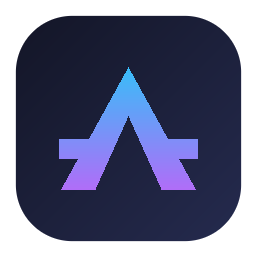

# Antigravity Project Launcher

> Fast Windows launcher for Antigravity IDE projects with Markdown import, live project synchronization, and persistent notes.



---

## ⚡ Características Principales

- **⌨️ Keyboard-First Launcher**: Invocación global con `Ctrl+Alt+Space` desde cualquier ventana en Windows 11.
- **🔄 Sincronización en Vivo**: Detección y precarga automática de proyectos recientes desde la base de datos de estado de Antigravity IDE (`%APPDATA%\Antigravity IDE\User\globalStorage\state.vscdb`) y carpetas locales (`projectsRoot`).
- **📥 Importación Drag & Drop de Markdown**: Arrastra cualquier archivo `.md` sobre la ventana para materializar un nuevo proyecto y abrirlo inmediatamente en Antigravity IDE.
- **🛡️ Manejo Inteligente de Colisiones**: Diálogos no destructivos si el nombre del proyecto o archivo Markdown ya existe.
- **📝 Notas Persistentes**: Panel lateral de notas rápidas por proyecto con autoguardado instantáneo en `%APPDATA%\Antigravity Project Launcher\metadata.json`.
- **🤖 Planificación Acelerada con ChatGPT**: Generación de prompts estructurados y apertura de ChatGPT con un solo atajo (`Ctrl+Shift+P`).
- **📌 Bandeja del Sistema (System Tray)**: Acceso rápido desde el área de notificación de Windows con menú contextual para abrir el lanzador, crear proyecto, configurar o salir.

---

## 🚀 Inicio Rápido

### Prerrequisitos
- **Windows 10 / 11** (64-bit).
- [Bun](https://bun.sh/) (v1.1+) o Node.js v20+.

### Instalación de dependencias
```bash
bun install
```

### Ejecución en Modo Desarrollo
```bash
bun run dev
```

### Chequeo de Tipos y Pruebas
```bash
bun run check
```

### Generación del Instalador (.exe)
```bash
bun run package
```
El instalador NSIS se generará en la carpeta `release/`.

---

## 🎹 Atajos de Teclado

| Atajo | Acción |
|---|---|
| `Ctrl+Alt+Space` | Abrir / Ocultar Launcher |
| `Escape` | Ocultar ventana |
| `ArrowUp` / `ArrowDown` | Navegar lista de proyectos |
| `Enter` | Abrir proyecto seleccionado en Antigravity IDE |
| `Tab` | Mover foco al panel de notas |
| `Ctrl+N` | Crear nuevo proyecto vacío |
| `Ctrl+Shift+P` | Planificar con ChatGPT (copiar prompt) |
| `Ctrl+,` | Abrir configuración |

---

## 🏗️ Estructura del Proyecto

```text
antigravity-manager/
├── resources/              # Iconos (.ico, .png, tray), icon-pack multi-plataforma y plantillas
│   ├── icon.ico
│   ├── icon.png
│   ├── tray-icon.ico
│   ├── tray-icon.png
│   ├── icon-pack/          # Icon pack completo (Windows, macOS, iOS, Android, Web, Master)
│   └── planning-prompt.md
├── scripts/                # Scripts de build y automatización de assets
├── src/
│   ├── adapters/           # Acceso a SQLite, ejecutables de Antigravity y SO
│   ├── domain/             # Lógica de validación, rutas canónicas y búsqueda
│   ├── main/               # Proceso principal de Electron, tray y ventanas
│   ├── preload/            # Context bridge IPC seguro
│   ├── renderer/           # Interfaz de usuario (HTML / CSS / TypeScript)
│   └── services/           # Servicios de configuración, descubrimiento y proyectos
├── tests/                  # Tests unitarios e integración (bun test)
└── electron-builder.yml    # Configuración de empaquetado NSIS para Windows
```

---

## 📄 Licencia

MIT License © 2026 Marco Marca.
